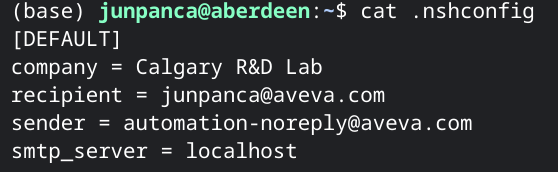
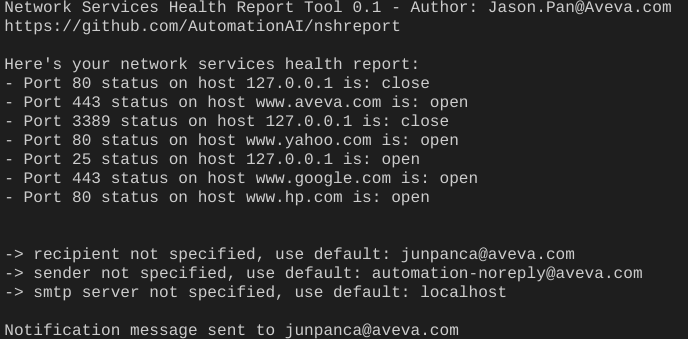

# Network Service Health Report Tool
## Use Cases
- Scheduled network service health report - with cron or Windows Task Scheduler
- Network service port testing after major changes

## Configuration file
- nshreport.ini file is required if you enable -n to send notifications
- Please create or copy nshreport.ini at your home user folder and modify as needed
- [Sample file to download](https://github.com/automationai/nshreport/blob/main/nshreport.ini)

## Usage
### Help
`port_test.py -h`
### Test single IP & Port
`port_test.py -a <ip>:<port>`
### Test IP & Port loaded from a file
`port_test.py -f <file>`
### Test IP & Port loaded from a file and send email notification
`port_test.py -f <file> -r <recipient> -s <sender> -m <smtp_server>`

## Source file
Format each line as <ip> <port>

## Result

## To do list
- test on windows
- compile for end users
- set cron task
- check the possibility to separate configparse file open error
- move ini to project folder & add to dist
