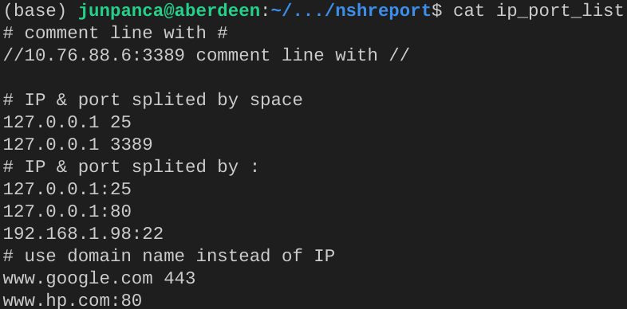
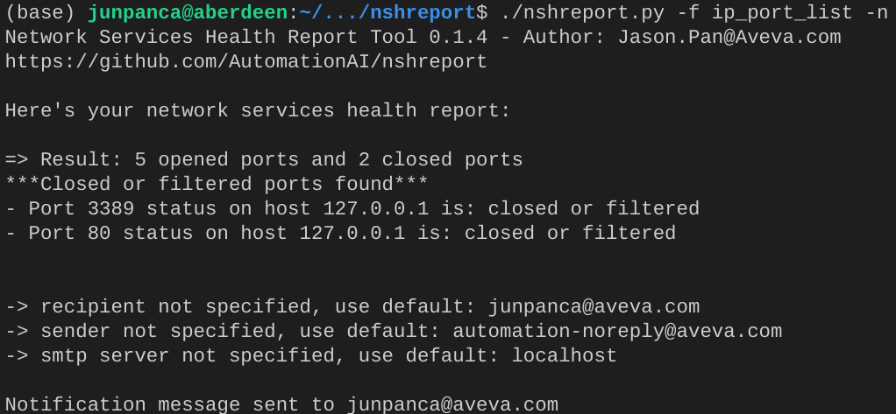

# Network Service Health Report Tool
Current Version: 0.1
## Use Cases
### Monitor the Network Serivce Health Status
This tool can ben scheduled to run daily with cron or Windows Task Scheduler to send notfications in case there's any network serivce port stopped working. Work proactively to ensure the fulfillment of your SLA!

### Network service port testing after major changes
It would reduce work load significantly when doing UAT test after a major network change!

### Sample Email Report

## Quick Start
### Step 1: Download the souce code (developer) or executables based on your platform (non developer)

#### Source code
`git clone https://github.com/automationai/nshreport.git`

#### Windows Executable
[Click here to download Window executable file](https://github.com/automationai/nshreport/raw/main/dist/nshreport.exe)

Tested on Windows 10, if you have other versions of windows, let me know the result, there's possiblility that old version of executables need to be generated separately.

#### Debian Executable
[Click here to download debian executable file](https://github.com/automationai/nshreport/raw/main/dist/nshreport)

Tested on Debian 10 & Ubuntu 20, if you have other versions of linux, let me know the result, there's possiblility that old version of executables need to be generated separately.

#### Mac

Currently don't have a mac to generate the Mac executables. If you can help to generate the executabls for Mac from the source code. Highly appreciated!

### Step 2: Open a command window, run nshreport.py (developer), ./nshreport (linux) or nshreport.exe (windows) first time
A configured file will be create under your user home foler. Below is the screenshot from linux machine, for the windows, the location is different, you can find it on screen when you run it.

### Step 3: (Optional) Update the configure file if you want to enable -n to send notifications
You can ignore this step if you don't need to send notifications or want to use command line arguments

Sample configuration file:

### Step 4: (Optional) Create an address file to test with the format as below. In his example we call it ip_list
You can ignore this step if you don't need to use -f argument to scan all the addresses all at once

### Step 5: Sample run 1:
`./nshreport -a www.google.com:443`

result:

### (Optional) Step 6: Sample run 2:
`./nshreport -f ip_list -n`

result:

### We all set now! Add the executable path to $PATH if you want more convenience!

## Usage
### Get help
`nshreport -h`

### Test single IP & Port
`nshreport -a <ip>:<port>`

### Test with all IPs & ports in one file
*Above Step 4 is required to continue from here*
#### Test IP & Port loaded from a file
`nshreport -f <file>`
#### Test IP & Port loaded from a file and send email notification with command line
`nshreport -f <file> -n -r <recipient> -s <sender> -m <smtp_server>`

*Above Step 3 is required to continue from here*

#### Test IP & Port loaded from a file and send email notification with config file
`nshreport -f <file> -n`
